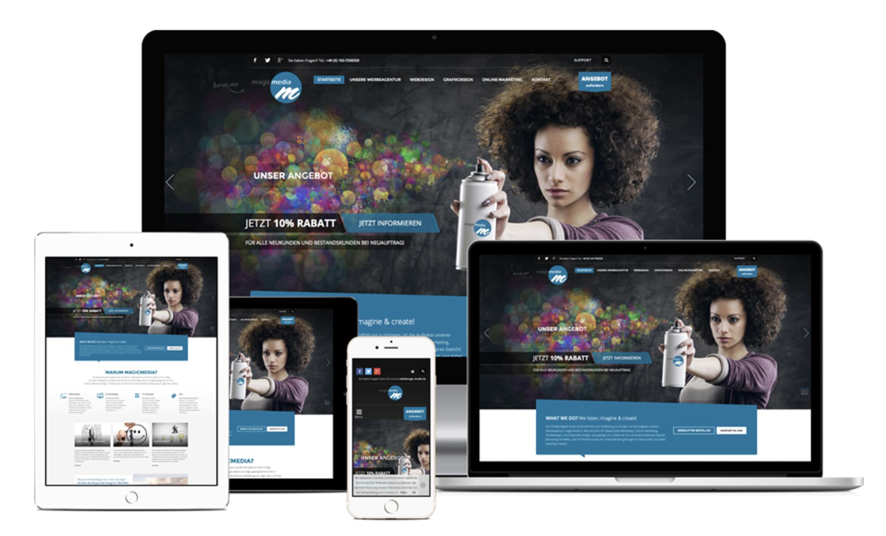

# Your Tribe - Squad page

## Responsive Design

_In de workshop S01W2-03-responsive-design wordt behandeld wat Responsive Design is, waarom het belangrijk is en hoe je met een Media Query in CSS de layout voor verschillende schermen kan maken._

Als je een squad page ontwerpt, moet je ervoor zorgen dat het op alle apparaten goed werkt. Heb web is niet een statische plek qua verhoudingen, zoals een krant of magazine. Elk device en elk scherm kan weer een eigen formaat en verhouding hebben.

Met responsive design zorg je ervoor dat jouw website het op alle apparaten, met allemaal verschillende groottes, andere schermen en verhoudingen, het goed doet.



### Schermgroottes en pixels
Wat voor verschillende apparaten en pixels hebben jullie?

#### Opdracht
1. Zoek de pixelwaardes en resoluties van alle apparaten aan de tafel op
2. Schrijf deze pixelwaardes op het whiteboard achter ieders naam
3. Vraag elkaar op welke devices je op internet zit, hoeveel procent op welk device?
4. Schrijf dit op het whiteboard achter ieders naam
5. Ga naar [Statcounter](https://gs.statcounter.com/platform-market-share/desktop-mobile-tablet/worldwide) en vergelijk de antwoorden met de statistieken
6. Extra: verander van werelddeel op Statcounter en bekijk de verschillen


### Devtools & Responsive layouts

De devtools hebben ook handige functionaliteiten om je website te debuggen op verschillende verhoudingen. 

1. Open de developer tools op een website, door een element te inspecteren met je rechtermuisknop.
2. Klik op de “Device toolbar” knop


Dit is een screenshot van Chrome, in de andere browsers zit het knopje misschien op een andere plek en in Safari kun je het via de menu bar “Develop” -> “Enter Responsive Design Mode” vinden.

3. Afhankelijk van je laatste instellingen zie je nu de site in een bepaalde verhouding.

4. Je kunt de verhoudingen aanpassen door de tools te gebruiken in deze device mode. Je kunt een bestaande verhouding kiezen of zelf de afmetingen bepalen. 


Chrome probeert dan je de volledige verhouding in beeld te geven, dit kan er soms voor zorgen dat het uitgezoomd is (irritant!). Gelukkig kun je dit ook instellen door het percentage op 100% te zetten. Over throttling gaan we het een andere keer hebben.

Naast dat je de devtools kunt gebruiken kun je natuurlijk ook met je browser heen en weer slepen om te kijken wat er gebeurt op verschillende verhoudingen. Als je de devtools open hebt staan, kun je als je heen en weer sleept ook de pixelwaardes zien in de rechterbovenhoek van je website.

#### Opdracht Responsive layouts

1. Ga naar je favoriete nieuwssite, ieder aan de tafel een ander (zoals nos.nl, ad.nl, parool.nl, cnn.com)
2. Zoek uit op welke formaten en pixelwaardes de site een andere layout laat zien
3. Schrijf deze pixelwaardes op het bord
4. Wat valt je op? Bespreek dit met je tafel


### Media Queries

Met CSS kun je regels schrijven waarmee de browser de website anders toont op verschillende formaten. Dit kan zowel in de breedte als de hoogte zijn, of bijv. portrait en landscape mode. Dit doen we met “Media Queries”:

```css
body {
    background: pink;

    @media (min-width: 30em) {
        background: yellow;
    }
}
```


#### Opdracht

1. Maak in je Digital Garden/Learning Journal een HTML file aan, noem het "mediaquery.html" (we gaan in workshops vaker kleine experimentjes toevoegen aan je Digital Garden)
2. Maak een CSS file aan, noem dit "mediaquery.css" en koppel het aan het HTML file
3. Geef het document een achtergrondkleur. Voeg dit bijvoorbeeld toe aan je CSS: 

```css
body {
    background: pink;
}
``` 
4. Open het HTML file in een browser en check of het werkt. Gebruik devtools om te debuggen
5. Voeg een _media query_ toe aan de CSS, om de achtergrondkleur te veranderen bij een bepaalde breedte
6. Test in de browser of het werkt
7. Advanced: Check het artikel [A Complete Guide to CSS Media Queries](https://css-tricks.com/a-complete-guide-to-css-media-queries/) en probeer verschillende technieken uit


### Breakpoints en Breakdown schets van de squad page

Schets en maak een responsive design voor je squad page.


<small><i>Breakdownschets met breakpoint</i></small>


#### Opdracht

1. Schets de squad page voor een mobiel scherm (Small) en een laptop scherm (Large)
2. Maak een breakdown schets met HTML en pseudo CSS code
3. Bepaal het breakpoint, bij welke schermbreedte krijg je een andere layout te zien? Maak aantekeningen op je breakdown schets
4. Upload je breakdown schets in een issue en leg deze kort uit
5. Leg je breakdown schets uit aan iemand van je tafel en vraag om feedback, laat de persoon dit bij je issue schrijven
6. Bouw je squad page met één, of meerdere, media query
7. Test regelmatig in je browser of je media query goed werkt. Test het ook op je mobiel.


### Bronnen 

- [Statcounter mobile/desktop/tablet](https://gs.statcounter.com/platform-market-share/desktop-mobile-tablet/worldwide)
- [A Complete Guide to CSS Media Queries @ CSS Tricks](https://css-tricks.com/a-complete-guide-to-css-media-queries/)
- [Beginner guide to Media Queries @ MDN](https://developer.mozilla.org/en-US/docs/Learn/CSS/CSS_layout/Media_queries)
- [Viewport meta tag @ MDN](https://developer.mozilla.org/en-US/docs/Web/HTML/Viewport_meta_tag)

<!--
- [Whatsmyviewport](https://whatismyviewport.com/)
- Een browser die _Responsive_ makkelijker maakt? 🚀 Gebruik [Polypane](https://polypane.app/) (gratis voor studenten)
-->


**Meer lezen over Responsive**
- [How Much Has The Web Really Changed? @ Smashing Magazine](https://www.smashingmagazine.com/2013/05/new-defaults-web-design/)
- [The New Multi-screen World](https://www.thinkwithgoogle.com/marketing-strategies/app-and-mobile/the-new-multi-screen-world-study/)
- [The ideal viewport doesn’t exist](https://viewports.fyi)


